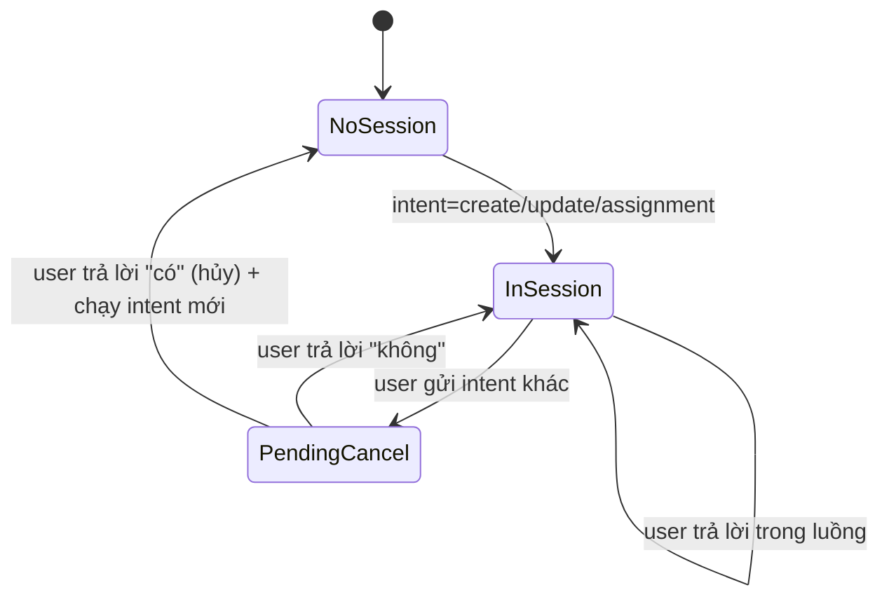

# Awesome Agent API (Chatbot Auto PM) — mô tả hệ thống & luồng xử lý

Hệ thống này là một **chatbot hỗ trợ quản lý dự án** (PM Assistant) chạy bằng **FastAPI**, tích hợp **Plane.so** để đọc/ghi dữ liệu dự án (project/task/member) và dùng **LLM** để:

- Hiểu “ý định” người dùng (router/intents) để định tuyến tác vụ.
- Trích xuất dữ liệu có cấu trúc từ file/báo cáo.
- Trả lời Q&A dựa trên dữ liệu Plane (RAG).
- Hỗ trợ “chế độ báo cáo” (mode_report) cho **staff/manager** và đẩy báo cáo lên Plane.

---

## 1) Thành phần chính

### 1.1 API layer (FastAPI)
- Entry point: `src/auto_pm_agent_api/infrastructure/api/main.py`
- Endpoint chính:
  - `POST /chat`: chat + điều phối toàn bộ luồng.
  - `POST /reports/extract`: trích xuất báo cáo text → JSON có cấu trúc.
  - `POST /memory/clear`: xóa lịch sử hội thoại theo `user_id`.

### 1.2 Orchestrator (Application layer)
- `ChatService`: `src/auto_pm_agent_api/application/chat_service/chat_service.py`
  - Là “bộ điều phối” trung tâm: đọc history, phân luồng theo role, quản lý session, gọi các service con.

### 1.3 Các service con
- **Project CRUD / update**: `ProjectManagementService`
  - `src/auto_pm_agent_api/application/project_management_service/project_management_service.py`
  - Tạo project từ file, update/create/delete project/task, add/remove member… đều theo mô hình “hỏi xác nhận rồi mới thực thi”.
- **Q&A (RAG)**: `QAService`
  - `src/auto_pm_agent_api/application/qa_service/qa_service.py`
  - Fetch dữ liệu từ Plane → index (dense + sparse) → build context → LLM trả lời.
- **Phân công task**: `AssignmentService`
  - `src/auto_pm_agent_api/application/assignment_service/assignment_service.py`
  - Gợi ý phân công bằng LLM dựa trên workload + profile → hỏi xác nhận → update assignee lên Plane.
- **Report mode**: `ReportSessionManager`
  - `src/auto_pm_agent_api/application/report_session.py`
  - Quản lý state báo cáo theo user, rewrite báo cáo bằng LLM, và đẩy “daily progress” lên Plane.
- **Trích xuất báo cáo cấu trúc**: `WorkReportExtractor`
  - `src/auto_pm_agent_api/application/report_service/work_report_extractor.py`
  - Dùng LLM structured output để chuẩn hóa báo cáo (tasks/blockers/achievements/notes…).

### 1.4 Infrastructure tích hợp
- **LLM client**: `src/auto_pm_agent_api/infrastructure/llm_providers/llm_client.py`
  - Dựa trên LangChain `init_chat_model`, có thể dùng OpenAI hoặc OpenRouter (dựa vào format API key).
- **Intent router**: `src/auto_pm_agent_api/infrastructure/llm_providers/router.py`
  - LLM-based classifier trả về `IntentResult`.
- **General bot**: `src/auto_pm_agent_api/infrastructure/llm_providers/general_bot.py`
  - Trả lời các chủ đề ngoài phạm vi project/task.
- **Plane client**: `src/auto_pm_agent_api/infrastructure/plane_client/plane_api_client.py`
  - CRUD projects/issues/members + daily-progress endpoints.
- **Memory (Redis)**: `src/auto_pm_agent_api/infrastructure/db/redis_memory.py`
  - Lưu lịch sử hội thoại theo user (`chat_history:{user_id}`), giữ tối đa 10 tin gần nhất.

---

## 2) Dữ liệu vào/ra quan trọng

### 2.1 `POST /chat`
Model: `src/auto_pm_agent_api/infrastructure/api/models.py`

Input (rút gọn):
```json
{
  "user_id": 123,
  "role": "manager",
  "query": "Tạo project mới từ file này",
  "file_content": null,
  "mode_report": false
}
```

Output (rút gọn):
```json
{
  "success": true,
  "response": "…",
  "mode_report": false
}
```

### 2.2 `mode_report` là gì?
`mode_report` là một **cờ trạng thái do client giữ và gửi lên mỗi request** để báo cho backend rằng người dùng đang ở “phiên báo cáo”.

- Khi `mode_report=true`, `ReportSessionManager` sẽ ưu tiên xử lý theo logic báo cáo.
- Khi người dùng nói “kết thúc báo cáo”, backend sẽ **tự trả về `mode_report=false`** để client thoát chế độ báo cáo.

---

## 3) Luồng xử lý tổng quan của `POST /chat`

Trục chính nằm trong `ChatService.handle_query()`:
`src/auto_pm_agent_api/application/chat_service/chat_service.py`

Pseudo-flow (đã bám sát code):
1. **Nếu có `file_content`**:
   - Lưu `active_sessions[user_id] = {file_content, session_type: None}`.
   - Trả lời “đã đọc file” và kết thúc request.
2. Lấy **history gần nhất** từ Redis (limit=5) để đưa vào prompt/router.
3. Phân nhánh theo `role`:
   - **staff**: bỏ qua router; chỉ chạy `ReportSessionManager.handle_staff()` và/hoặc QA.
   - **manager**: chạy `ReportSessionManager.handle_manager()` trước (để xử lý report mode “không phá” các luồng khác).
4. Nếu **manager có active session** đang chạy (`create/update/assignment`):
   - Tiếp tục luồng đó, hoặc hỏi xác nhận hủy luồng nếu user gửi yêu cầu mới khác intent.
5. Nếu không có session:
   - Chạy **Intent Router (LLM)** → nhận `intent`.
   - Áp dụng heuristic override (ví dụ add/remove member + “project” → ép sang update).
   - Route sang service tương ứng (project/qa/assignment/general).
6. Lưu (user, bot) vào Redis.
7. Trả về `response` và `mode_report` hiện tại.

---

## 4) Luồng theo vai trò (staff vs manager)

### 4.1 Staff: QA + Report mode (không dùng router)
Trong `ChatService.handle_query()`:
- Nếu `role == staff`:
  - Map `Zalo user_id -> Plane user_id` bằng `GET /api/zalo-users/{zalo_id}/` (cache nội bộ).
  - Gọi `ReportSessionManager.handle_staff(...)`.
  - QA fallback sẽ gọi `QAService.handle_query(..., assignee_filter=<plane_user_id>)`.

**Ý nghĩa**: staff chỉ được hỏi/tra cứu theo “task của mình” (best-effort theo assignee_filter), và dùng mode_report để gửi báo cáo.

### 4.2 Manager: Router + session + Report mode “không xâm lấn”
Manager flow có 2 “kênh” chạy song song:
- **Kênh report mode**: chạy trước bằng `handle_manager(...)` nếu `mode_report=true`.
- **Kênh công việc**: router → create/update/assignment/QA nếu report không xử lý.

Điểm quan trọng: report mode của manager được thiết kế **không phá** các session create/update/assignment đang chạy; nếu không match logic report thì trả về `handled=False` để tiếp tục router/luồng khác.

---

## 5) Session management: “luồng nhiều bước” và cơ chế hủy

Hệ thống có 2 loại state:
1. **Conversation memory** (Redis): để cung cấp ngữ cảnh hội thoại (tối đa 10 tin, lấy 5 tin khi route).
2. **Session state** (in-memory dict): để giữ “workflow nhiều bước”:
   - `ChatService.active_sessions[user_id]`: session của manager (`create_new_project`, `update_existing_information`, `assignment`) và file_content tạm.
   - `ProjectManagementService.sessions[user_id]`: session trạng thái tạo/update.
   - `AssignmentService.sessions[user_id]`: session trạng thái phân công.
   - `ReportSessionManager.sessions[user_id]`: session báo cáo (staff/manager).

### 5.1 State machine hủy luồng (manager)
Khi manager đang có session mà lại gửi yêu cầu khác intent, hệ thống sẽ hỏi:
“Bạn muốn hủy luồng hiện tại để chuyển sang yêu cầu mới không?”



---

## 6) Luồng tạo project từ file (create_new_project)

Service: `ProjectManagementService.handle_create_project()`
`src/auto_pm_agent_api/application/project_management_service/project_management_service.py`

Các bước chính:
1. User gửi `file_content` (qua `/chat`) → `ChatService` lưu vào `active_sessions[user_id].file_content`.
2. User ra lệnh tạo project → intent router trả `create_new_project`.
3. `PlaneExtractor` dùng prompt `PROMPT_PLANE_EXTRACT` để trích xuất:
   - `project {name, identifier, description}`
   - `tasks[] {name, description, start_date, target_date}`
4. Bot hỏi xác nhận: “Bạn có muốn tôi cập nhật dự án lên Plane không?”
5. Nếu user đồng ý:
   - Gọi Plane API:
     - `find_project_by_name` để tránh lỗi 409.
     - `create_project` nếu chưa có.
     - `create_issue` cho từng task.
6. Kết thúc session (xóa state) và trả link kiểm tra trong Plane.

---

## 7) Luồng cập nhật dữ liệu Plane (update_existing_information / update_plane_information)

Service: `ProjectManagementService.handle_update_info()`

### 7.1 Trích xuất “ý định cập nhật” bằng LLM
Sử dụng prompt `PROMPT_EXTRACT_UPDATE` để map yêu cầu về action:
- `create_project`, `update_project`, `delete_project`
- `create_task`, `update_task`, `delete_task`
- `add_member`, `remove_member`

Sau đó chuẩn hóa field:
- Dùng whitelist field hợp lệ (project/task) và `FRIENDLY_FIELD_MAP` để map “mô tả/deadline/người làm…” → field Plane.

### 7.2 Hỏi xác nhận rồi mới thực thi
Sau khi chuẩn bị đủ “update_info”, service sẽ:
- đặt `session.status = waiting_confirmation`
- trả prompt xác nhận (confirm message)

Khi user trả lời “có/ok/đồng ý”:
- gọi `_execute_update_action()` để thực thi qua `PlaneAPIClient`.

---

## 8) Luồng phân công task (assignment)

Service: `AssignmentService.handle_assignment()`

Các bước:
1. Xác định project từ query (match name/identifier/id); nếu không rõ → hỏi user chọn project.
2. Lấy issues trong project → lọc `unassigned_tasks` (chưa có assignee).
3. Lấy members + tính workload (#task đang được assign).
4. Enrich member bằng profile service (nếu cấu hình):
   - `USER_SERVICE_BASE_URL` hoặc `ZALO_WEBHOOK_BASE_URL`
5. Gọi LLM để tạo `AssignmentPlan` (JSON schema) → danh sách gợi ý assign.
6. Bot hỏi xác nhận; nếu user đồng ý:
   - `plane_api.update_issue(..., assignee=<assignee_id>)` cho từng task.

---

## 9) Luồng Q&A (RAG) trên dữ liệu Plane

Service: `QAService.handle_query()`

### 9.1 Data ingestion
- `list_projects()`
- Với mỗi project: `list_issues(project_id=...)`
- `list_members()` và/hoặc `list_project_members(project_id)` để có dữ liệu member.
- Nếu staff: truyền `assignee_filter` để lọc issues theo assignee.

### 9.2 Index & retrieval (Hybrid RAG)
Retriever: `HybridRAGRetriever`
- **Dense**: OpenAI embeddings (`text-embedding-3-small`) nếu có key.
- **Sparse**: TF‑IDF nội bộ (fallback được).
- Điểm kết hợp: `0.65 * dense + 0.35 * sparse`, có boost theo type (`issue` > `project` > `member`).

Structured context: `GraphStructuredRetriever`
- Gom nhóm theo project → issues → members, giúp prompt có “tổng quan + chi tiết”.

### 9.3 Answering
LLM trả lời theo `PROMPT_QA_RAG`, quy tắc đáng chú ý:
- “Chỉ trả lời dựa trên dữ liệu được cung cấp”.
- “Không trả về ID Plane”.

---

## 10) Luồng Report mode (báo cáo hằng ngày)

State nằm trong `ReportSessionManager.sessions[user_id]`, các field thường gặp:
- `mode_report`: đang ở chế độ báo cáo hay không
- `first_prompt_sent`: đã gửi prompt mở đầu chưa
- `report_text`: bản nháp báo cáo đã được rewrite
- `infor_report`: danh sách statement thô của user
- `report_context`: context lấy từ Plane hoặc payload client

### 10.1 Staff report mode
Luồng chính:
1. Client bật `mode_report=true`.
2. Lần đầu vào report mode:
   - Build context từ Plane: gom tasks theo assignee, lấy tasks của staff.
   - GeneralBot tạo prompt yêu cầu staff báo cáo theo 3 mục (tiến độ/blockers/kế hoạch).
3. Staff gửi statement → hệ thống nhận diện bằng keyword và:
   - Rewrite/merge vào `report_text` bằng LLM (fallback append nếu lỗi).
4. Staff nói “kết thúc báo cáo”:
   - Push báo cáo lên Plane bằng daily-progress API (create rồi patch nếu đã tồn tại).
   - Reset state, trả về `mode_report=false`.

### 10.2 Manager report mode
Tương tự staff, nhưng “statement” có thể là review/feedback.
Ngoài ra manager có thể gửi payload JSON từ client (ngày, projects, issues, has_report…) để bot tóm tắt tình trạng báo cáo.

### 10.3 Đẩy báo cáo lên Plane (daily progress)
Trong `_push_report_to_plane()`:
- Map `Zalo user_id -> Plane user_id` (nếu endpoint hỗ trợ).
- `list_issues(assignee=<plane_user_id>)`
- Với mỗi issue:
  - `create_daily_progress(project_id, issue_id, payload)`
  - Nếu lỗi (thường là đã có entry): `list_daily_progress(..., day=today)` rồi `update_daily_progress(...)`

---

## 11) Cấu hình môi trường (env)

Các biến quan trọng (tham khảo `.env` và code):
- LLM:
  - `MODEL_NAME`
  - `API_KEY` hoặc `OPENAI_API_KEY`
  - `BASE_URL` (OpenAI-compatible base URL; dùng OpenRouter thì tự set)
- Plane:
  - `PLANE_BASE_URL`
  - `PLANE_API_KEY`
  - `PLANE_WORKSPACE_SLUG`
- Redis:
  - `REDIS_HOST`
  - `REDIS_PORT`
- RAG:
  - `RAG_EMBEDDING_BACKEND` = `openai` | `local`
- Profile enrichment (assignment):
  - `USER_SERVICE_BASE_URL` hoặc `ZALO_WEBHOOK_BASE_URL`

---

## 12) Hạn chế hiện tại (theo đúng cách code đang hoạt động)
- Session/report state đang **in-memory** → restart service là mất luồng đang chạy; scale nhiều instance sẽ không chia sẻ state.
- Mapping `Zalo user_id -> Plane user_id` phụ thuộc endpoint `/api/zalo-users/{id}`; nếu thiếu/khác format thì lọc assignee & push report có thể không đúng.
- Router intent là LLM-based → có thể phân loại sai; code có heuristic override cho một số case (add/remove member).
- QA/RAG hiện build index “tại chỗ” trong process; không có vector DB persist.

---

## 13) Chạy server (tham khảo)
- Dev: `uvicorn auto_pm_agent_api.infrastructure.api.main:app --reload --host 0.0.0.0 --port 8000`
- Docker: xem `Dockerfile` và `docker-compose.yaml`

